layout: true
background-image: url(xaringan_stuff/img/r_geocomp_background.png)
background-size: cover
---
#OBJETIVOS:

.pull-left[

- R se convierta en un programa de elección dentro de su caja de herramienta geoespacial para muchas aplicaciones.
- Despertar la curiosidad por el mundo de la ciencia de los datos espaciales.
- Introducir conceptos básicos para que posteriormente puedan aplicarlo analizando los diferentes problemas que suceden en el espacio geográfico.
- Comunicar sus trabajos con gráficos estadísticos y mapas estáticos o interactivos con códigos reproducibles.

]


.pull-right[

```{r, echo=FALSE, message=FALSE, out.height="300",out.width="400"}
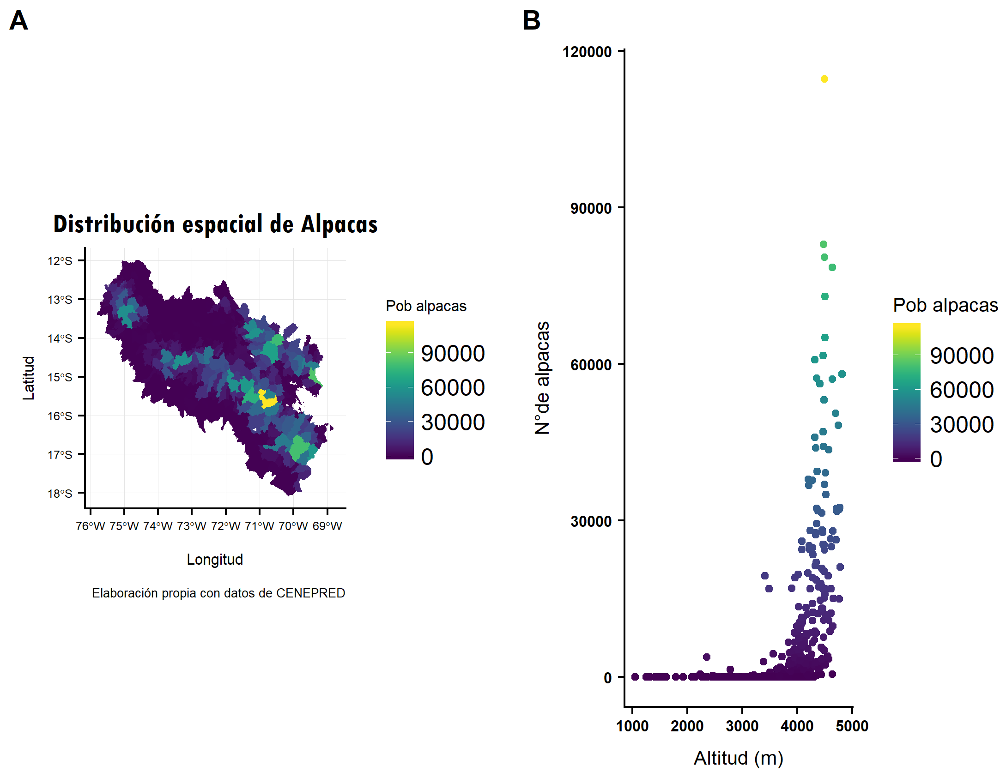
```

]

---
# INTRODUCCIÓN

.pull-left[

- R fue creado en el año 1992 en Nueva Zelanda por **Ross Ihaka** y **Robert Gentlenman**.
- La **intención inicial con R era** hacer un lenguaje didáctico **para ser utilizado en** el curso de Introductorio de **estadística** a la Universidad de Nueva Zelanda.
- El **Predecesor de R es el lenguaje S** desarrollado por Bell Laboratories.
- 1993 se da a conocer por primera vez al público del software R y en el año **1997 R forma para del proyecto GNU**.
######**_fuente(Julio Santana y Efraín Farfán, 2014)_**

]


.pull-right[

```{r, echo=FALSE,fig.align='center'}
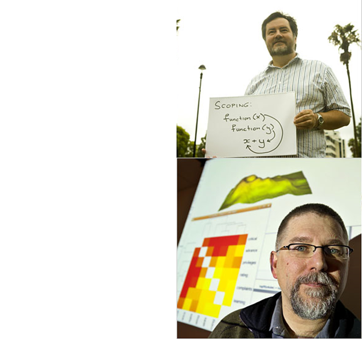
```

]

---
#¿QUÉ ES R?

R es un entorno de programación y un lenguaje interpretado de codigo abierto multiplataforma que nos permite hacer diferentes tipos de análisis estadísticos **(Robin Lovelace et.al,2019)**, desde importar los datos, ordenarlos, modelarlos, visualizarlo mediante gráficos de alta calidad e incluir en informes académicos de manera científica **(Hadley Wickham y Garrett Grolemund,2017)**.

.pull-left[

```{r, echo=FALSE, out.height= "300", out.width="600", fig.align= 'center'}
knitr::include_graphics('./image/01_tidyverse_data_science.png')
```

]


.pull-right[

```{r, echo=FALSE, out.height= "300", out.width="800", fig.align= 'center'}
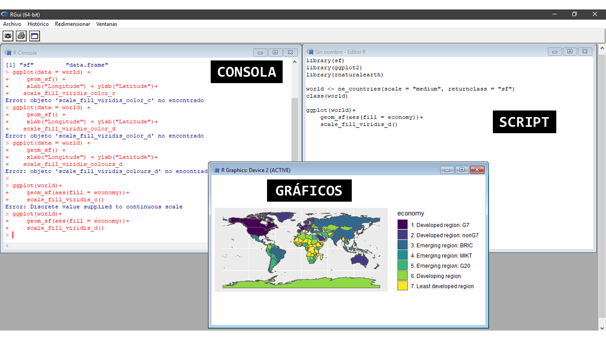
```

]

---
#¿QUÉ ES RSTUDIO?

Rstudio es un entorno de desarrollo integrado (IDE) para R. Incluye una consola, un editor de resaltado de sintaxis que admite la ejecución directa de código, así como herramientas para el trazado, el historial, la depuración y la administración del espacio de trabajo **(Rstudio)**.

**CONCLUSIÓN: "RSTUDIO ES EL ROSTRO BONITO DE R"**

```{r, echo=FALSE,out.height= "320", out.width="600", fig.align='center'}
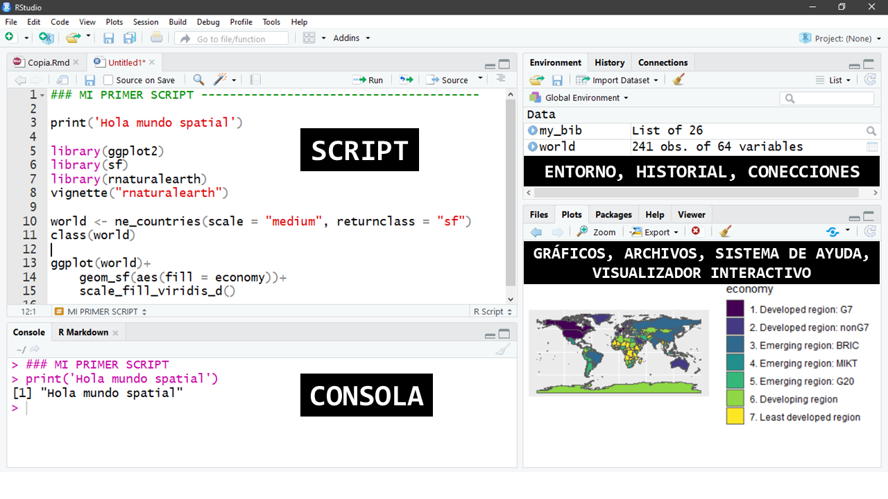
```

---
# ¿Cómo instalar R con Rstudio?
Para instalar R primero ingresamos al siguiente enlace:
[aquí](https://cran.r-project.org/).

```{r, echo=FALSE, fig.align='center', out.height= "200", out.width="200"}
knitr::include_graphics("./image/Rlogo.svg")
```

Para instalar Rstudio ingresamos de igual forma al siguiente enlace:
[aquí](https://www.rstudio.com/)

```{r, echo=FALSE, fig.align='center', out.height= "200", out.width="200"}
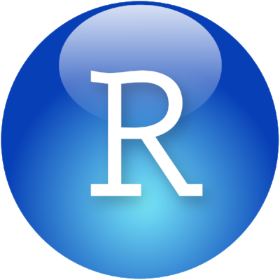
```
---

# ¿QUÉ ES LA GEOCOMPUTACIÓN?
LA Geocomputación es el **"USO DEL PODER DE LAS COMPUTADORAS PARA HACER COSAS CON DATOS GEOGRÁFICOS" (Robin Lovelace et.al,2019)**.
* Cosas:
    + leer (importar diferentes formatos tanto vectorial o raster)
    + ordenar(limpiar data)
    + modelar (técnicas de estadística espacial, machine learnig ..)
    + elaborar mapas (estáticos o interactivos)
    + **solucionar problemas del mundo real**
    
**APLICACIONES:**
- Data science
- Criminología
- Epidemiología
- Geografía humana y física 
- Riesgos de desastres
- Teledetección
- Ecología
- Estadística espacial
- ...


---
# ¿POR QUÉ R PARA LA GEOCOMPUTACIÓN?

.pull-left[

- R fue diseñado específicamente como una interfaz interactiva para otro software **(Chambers, 2016)**.
- R es más ventajoso para manejar y visualizar datos vectoriales y raster , y lo más importante es que tiene una **diversidad de paquetes para la estadística y la estadística espacial y para los modelos predicitos** a diferencia de **Phyton**.

- **R posee un amplio ecosistema espacial** de paquetes especializados.

]

.pull-right[

```{r, echo=FALSE, message=FALSE, out.height="400",out.width="300"}
knitr::include_graphics("./image/cover.png")
```

]

---
###¿CUÁL ES LA DIFERENCIA ENTRE UN SIG DE ESCRITORIO Y R?

```{r, echo=FALSE, fig.align='left', out.height="250", out.width="400", fig.align='center'}
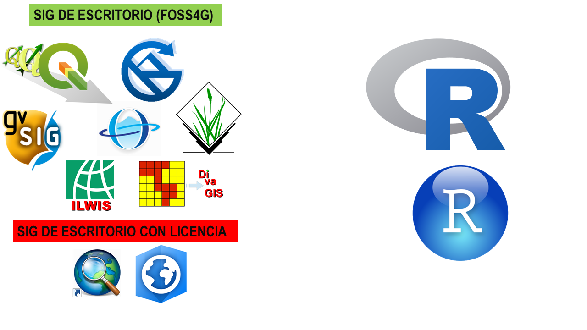
```

```{r,echo=FALSE, fig.align='default'}
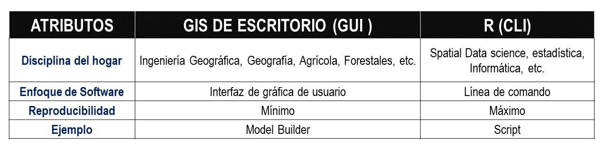
```
######_**fuente: Adaptación propia del cuadro de Robin Lovelace et.al,2019**_

---
# BREVE RESUMEN DE LA HISTORIA DE RSPATIAL

```{r, echo=FALSE}
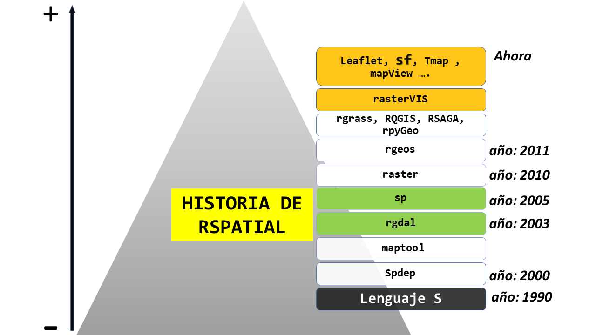
```

######_**fuente: Elaboración propia tomando los conceptos de Robin Lovelace et.al,2019**_

---
#INTRODUCCIÓN BÁSICA A LA SINTAXIS DE R
- ¿Qué es una función dentro de R y a que llamamos argumento?
- ¿Qué es un objeto dentro de R?
- R como calculadora
  * Funciones básicas escenciales
- ¿Como acceder al sist. de ayuda de R?
- Cuales son las 5 clases atómicas dentro de R
- Tipos de objetos en R
  * ¿Qué es un vector?
  * ¿Qué es un factor?
  * ¿Qué es una matrix?
  * ¿Qué es un data.frame?
  * ¿Qué es una lista?

```{r, echo=FALSE,fig.align='default'}
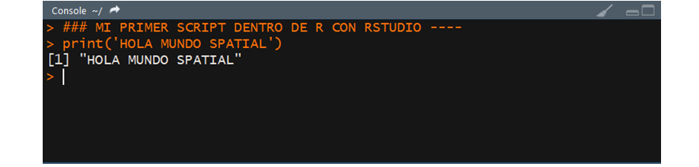
```

---

# ¿QUÉ ES UNA FUNCIÓN DENTRO DE R?
Es un **grupo de instrucciones** que toma un imput o dato de entrada y usa estos datos para obtener un resultado.

.pull-left[
```{r plot,eval=FALSE}
plot(1:10,
     (1:10)^2
     ,main ='Mi primer plot' )
```
]

.pull-right[
```{r ,eval=TRUE, ref.label="plot",echo=FALSE}

```

]
---

#¿QUÉ ES UN ARGUMENTO EN R?
Un argumento dentro de R, son las partes que conforman una función(**parámetros**)
```{r,echo=FALSE,fig.align='center'}
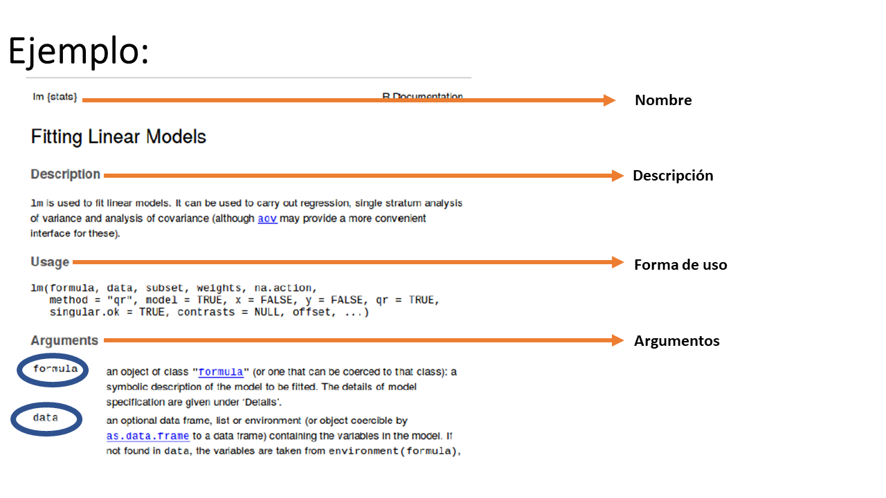
```

---
#¿QUÉ ES UN OBJETO DENTRO DE R?

Son todos aquellos que tienen una identidad (**nombre**), esencia (**datos**) y tienen un comportamiento (**operaciones**).
```{r,echo=FALSE,fig.align='center'}
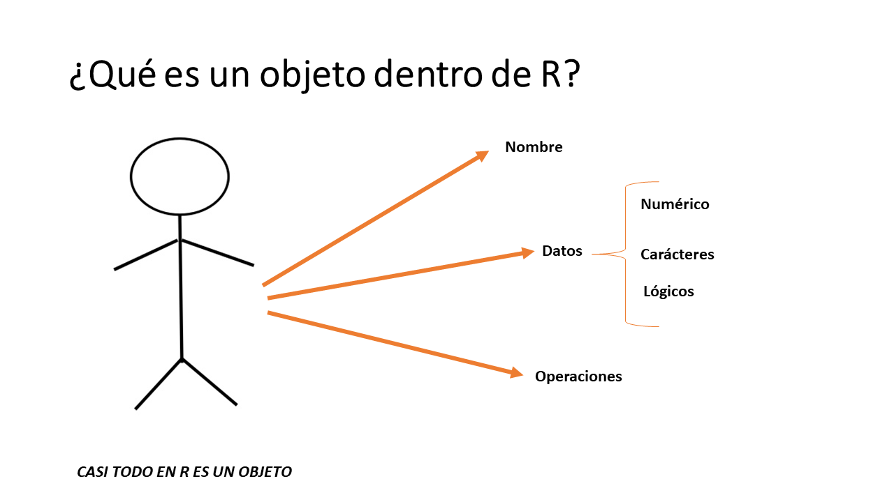
```
---
###R COMO CALCULADORA
#### -Cómo establecer nuestro workspace o directorio de tabajo.
  * Usando el **"/"**
  * Usando el doble **"\\"**
  * Usando **Sessions**

#### -Cómo asignar una variable dentro de R
  * Usando el simbolo **"<-"** (nunca separado)
  * Usando el simbolo **"="** (no recomendable)
  * Usando el simbolo invertido **"->"**
  * Usando la fun **assign("name",valor)**

#### -Cómo guardar nuestro script dentro de nuestro workspace.

#### -Funciones escenciales.
  * setwd(), getwd() 
  * dir(),ls(),rm()
  * summary(), mean(), sum(), sd()
  * q()
---
# ¿CÓMO ACCEDER AL SISTEMA DE AYUDA DE R?
### Funciones escenciales:
 * **help()** ========= > **?**
 * **help.search()** == > **??**
### Ejemplo:

```{r, eval=FALSE}
help('setwd')
help('lm')
?setwd
?lm
help.search('plot')
??plot
```
---
# LAS 5 CLASES ATÓMICAS DENTRO R
* Numérico (decimales, ..)
<br>
* entero (L)
<br>
* complejo (1 + 0i)
<br>
* Carácteres ("siempre entre comillas")
<br>
* Valores lógicos (TRUE or FALSE)

---
# TIPOS DE OBJETOS DENTRO DE R:

* Vector ========== > **c()** 
* Factor ========== > **factor()**
* Matrix ========== > **matrix()**
* Data.frame ====== > **data.frame**
* Lista  ========== > **list()**

---
##QUÉ ES LA INDEXACIÓN Y COERSION DENTRO DE R
-**Idexacion:** Extraer o acceder a los diferentes elementos de diferentes posiciones que presenta nuestro objeto dentro de su estructura.
Para ello los operadors de acceso o selección son:
 * **[posición]**
 * **[fila,columna]**
 * **[[]]**
 * **$**

-**Coersión:** La conversión o transformación que sufren nuestro datos a diferentes tipos de obejtos.
Para ello R posee un conjunto de funciones de la forma:
**as.<tipo>()**
Ejemplo:
 * as.vector()
 * as.numeric()
 * as.list()
 * as.factor()
 * ....
---
# SIG CON R 
```{r,echo=FALSE,fig.align='center',out.height="390",out.width="600"}

```
## La importancia del Dónde?
---
# ¿QUÉ ES UN SISTEMA DE INFORMACIÓN GEOGRÁFICA?
Es un conjunto de componentes que tiene como objetivo general trabajar con información georreferenciada.

```{r, echo=FALSE,fig.align='default'}
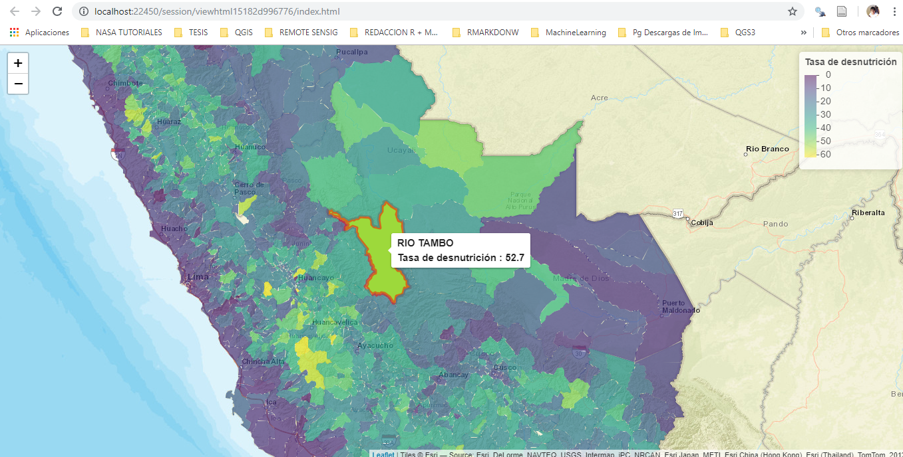
```

---
# COMPONENTES DE UN SIG:

.pull-left[
Un sistema de información geográfica está compuesto por:
- datos
- procesos
- visualización
- tecnología (software y hardware SIG)
- factor organizativo. 

Para terminar un **SIG REFLEJA LA REALIDAD**

]

.pull-right[

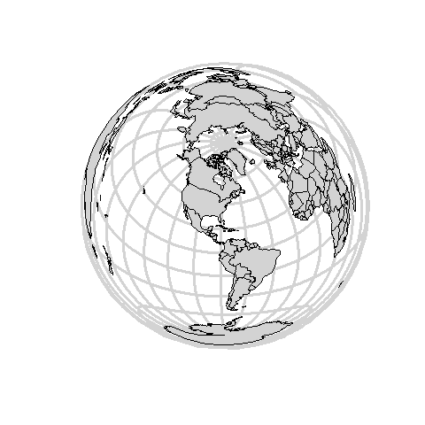

]
---

# TIPOS DE DATOS ESPACIALES:
Datos espaciales:Son todos los datos que presentan geolocalización, es decir presentan un SRC.

Existen dos tipos o modelos de datos espaciales, estos son:
* Datos vectoriales
* Datos raster

```{r, echo=FALSE, out.height="320", out.width="550", fig.align='center'}
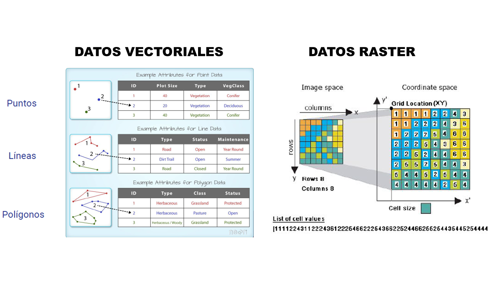
```

---
#¿QUÉ SON LOS DATOS VECTORIALES?
Los datos vectoriales son **formas geométricas** (punto, linea y poligonos) que representan a los elementos geográficos que existen en el territorio,se caracterizan por contener información de tipo cuantitativo o cualitativo a lo que generalmente se le llama **atributo**, y estos mismos están asociados a un Sistema de Referencia de Coordenada (**CRS**).
#### Ejemplo:

```{r,echo=FALSE,fig.align='center',out.height="300",out.width="600"}
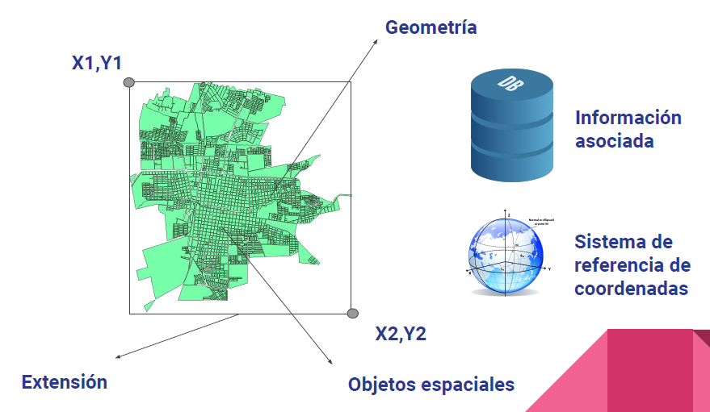
```

---
# TIPOS DE GEOPROCESAMIENTO CON DATOS VECTORIALES
El geoprocesamiento es la manipulación de los datos espacial bajo un entorno SIG; para los datos vectoriales los tipos de geoprocesamiento que se puede llevar acabo son las siguiente:

```{r,echo=FALSE,fig.align='center',out.height="300",out.width="600"}
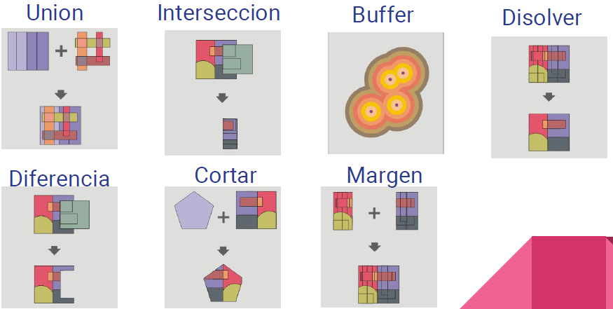
```
---
# ¿QUÉ SON LOS DATOS RASTER?
Los datos raster es una matrix de valores, donde la unidad mínima es el pixel, y este contiene información geolocalizada de tipo continua.

```{r,echo=FALSE,fig.align='center',out.height="300",out.width="600"}
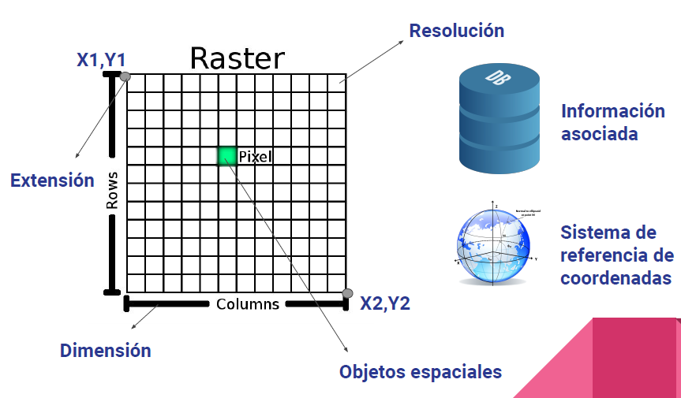
```


---
# TIPOS DE GEOPROCESAMIENTO CON DATOS RASTER

```{r ,echo=FALSE,fig.align='center',out.height="300",out.width="600"}
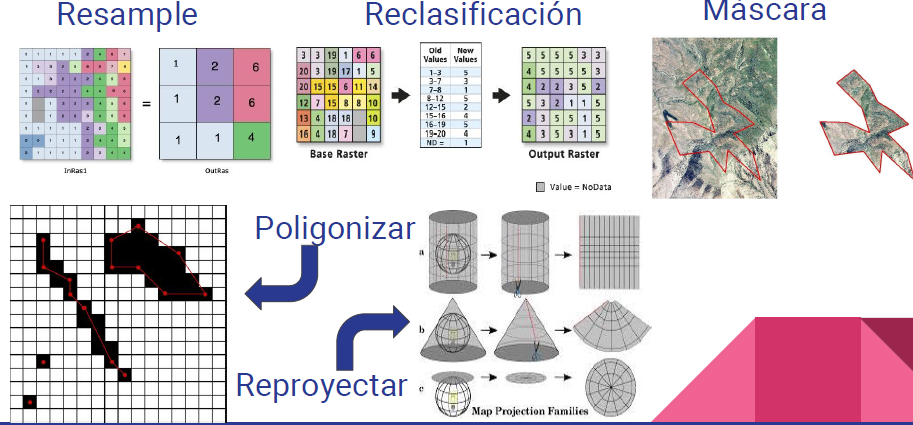
```
---
# TRABAJANDO CON EL PAQUETE SF y GGPLOT2
## Lectura de data 

```{r plot-label,eval=TRUE}
library(sf)
library(ggplot2)
library(viridis)
dep <- st_read('./data/vector/distritos.shp')
```
---
## Plot con sf y ggplot

```{r fig.align='center',echo=TRUE, out.height="400", out.width="400"}
(ggplot(dep,
        aes(fill = V_Susc)) +
        geom_sf(color = NA)) +
    scale_fill_viridis() + 
    theme_minimal()

```

---
# TRABAJANDO CON EL PAQUETE RASTER
## Lectura de data 

```{r plot-label2 ,eval=TRUE}
library(raster)
(tacna <- stack('./data/raster/Tacna_despues.tif'))
```

---
## Plot con raster

```{r fig.align='center',echo=TRUE, out.height="400", out.width="400"}
img <- setValues(tacna, scales::rescale(values(tacna), to = c(0, 255))) 
img[img == 0]<- NA
plotRGB(img,stretch = 'hist',axes =TRUE)

```

---
```{r,echo=FALSE,fig.align='center',fig.align='center', r,echo=FALSE}
library(mapview)
afther <- brick('./data/raster/Tacna_despues.tif')
before <- brick('./data/raster/Tacna_antes.tif')
t_despues <- setValues(tacna, scales::rescale(values(afther), to = c(0, 255)))
t_antes <- setValues(tacna, scales::rescale(values(before), to = c(0, 255)))
t_antes[t_antes == 0] <- NA
t_despues[t_despues == 0] <- NA
slideView(t_antes,t_despues)
```
---
# TRABAJANDO CON TMAP
Es un paquete dentro de R que nos permite elaborar mapas
temáticos con una cantidad mínima de codigo y está basado en la superposición de capas.

Para mayor información [aquí](https://www.jstatsoft.org/article/view/v084i06)

```{r, fig.align='center', out.width="500"}
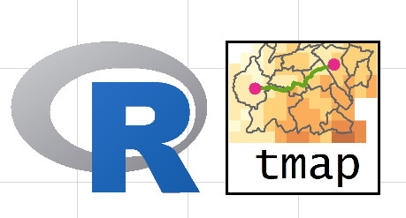
```


---

# Tmap + datos vectoriales

```{r, echo=TRUE,warning=FALSE,message=FALSE, eval=FALSE}
library(tmap)
library(sf)
library(viridis)
shp <- st_read('./data/vector/distritos.shp')
tm_shape(shp) + 
  tm_layout(frame = FALSE) + 
  tm_fill('V_Susc', palette = 'viridis')


```

---

# Tmap + datos vectoriales

```{r, echo=FALSE,warning=FALSE,fig.width=8, fig.height=4}
library(tmap)
library(sf)
library(viridis)
shp <- st_read('./data/vector/distritos.shp')
tm_shape(shp) + 
  tm_layout(frame = FALSE) + 
  tm_fill('V_Susc', palette = 'viridis')

```


---
# Tmap + raster 

```{r, echo=TRUE,warning=FALSE,message=FALSE, eval=FALSE}
library(tmap)
library(raster)
library(viridis)

dem <- raster('./data/raster/dem.tif')
tm_shape(dem) + tm_raster(palette = 'cividis',)

```
---

# Tmap + raster 

```{r, echo=FALSE,warning=FALSE,message=FALSE, eval=TRUE}
library(tmap)
library(raster)
library(viridis)

dem <- raster('./data/raster/dem.tif')
tm_shape(dem) + tm_raster(palette = 'cividis',)

```

---
class: middle
.center[
]
#GRACIAS ^^ !
### Estos slides fueron creados en: [xaringan](https://github.com/yihui/xaringan) con [RMarkdown](https://rmarkdown.rstudio.com/)

### La version original de estos slides puedes encontrarlos en el siguiente enlace:[aquí](https://github.com/Robinlovelace/erum18-transport)


